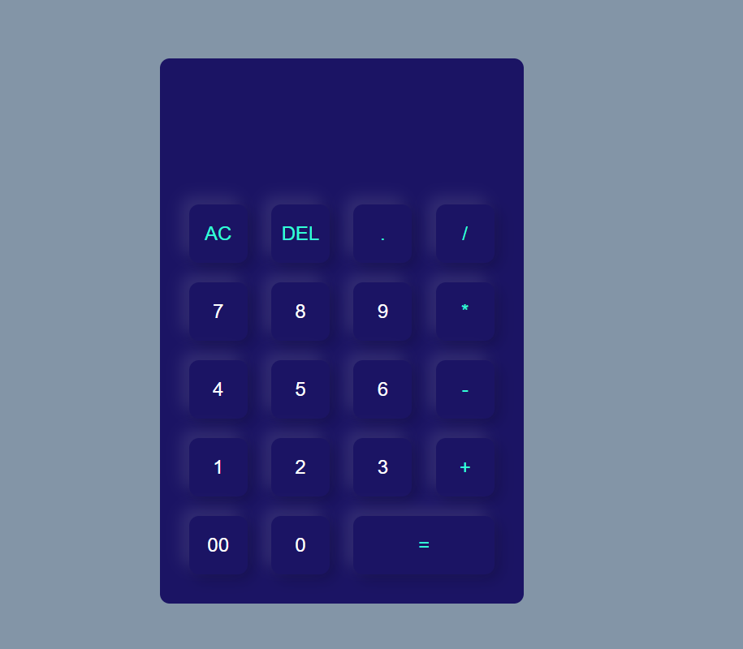
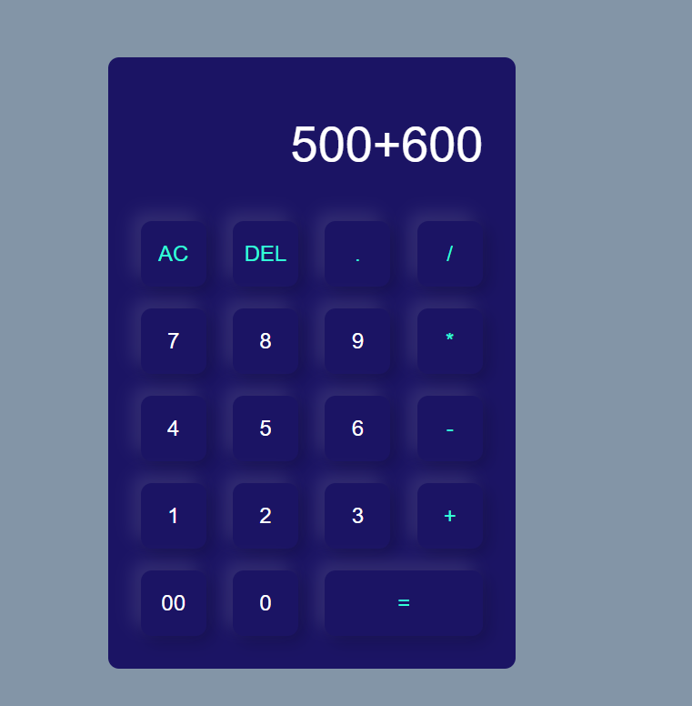

A modern, stylish calculator built using **HTML, CSS, and JavaScript** with a clean neumorphic UI. It performs basic arithmetic operations like addition, subtraction, multiplication, and division while keeping the design simple and user-friendly.  

---

## 📸 Preview  

### Calculator UI  

### Performing Calculation  

---

## ✨ Features  
- Neumorphic design with soft-glow effect  
- Basic operations: `+`, `-`, `*`, `/`  
- Clear (`AC`) and delete (`DEL`) buttons  
- Responsive layout for all screen sizes  
- Smooth and interactive UI  

---
